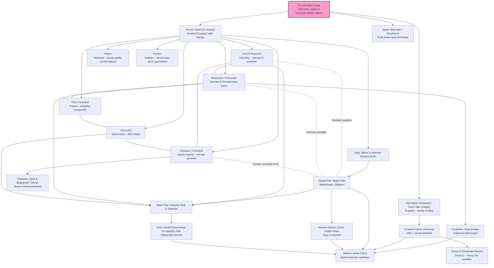
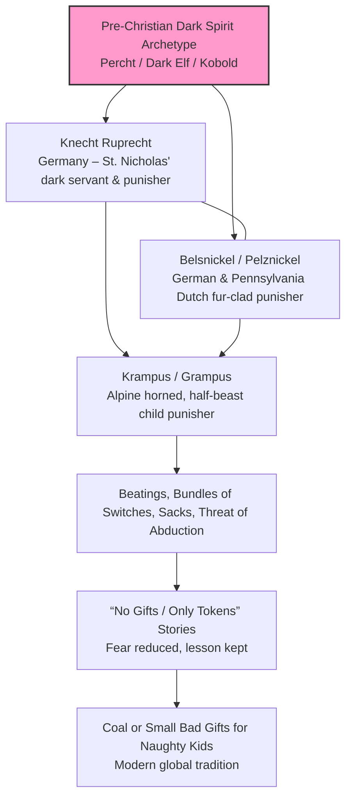

```mermaid
flowchart TD
    %% ROOTS
    A[Pre-Christian Roots<br/>Wild Hunt, Alpine & Germanic Winter Spirits]:::root

    %% DARK / WILD SPIRIT FAMILY
    A --> B[Percht / Dark Elf / Kobold<br/>Central European 'wild' beings]
    A --> B1[Alpine 'Wild Man' / Woodwose<br/>Feral winter spirit archetype]

    %% EARLY CHRISTIAN COMPANIONS OF ST NICHOLAS
    B --> C[Knecht Ruprecht<br/>Germany – servant & punisher]
    B --> D[Belsnickel / Pelznickel<br/>German & Pennsylvania Dutch]
    B --> E[Père Fouettard<br/>France – whipping companion]
    B --> F[Schmutzli<br/>Switzerland – dark helper]
    B --> G[Krampus / Grampus<br/>Alpine regions – horned punisher]

    %% INTERRELATIONS WITHIN COMPANIONS
    C --- G
    C --- D
    D --- E
    E --- F
    F --- G

    %% ZWARTE PIET / BLACK PETE CLUSTER
    B --> H0[Early 'Black' or Moorish Servant Motifs]
    H0 --> H[Zwarte Piet / Black Pete<br/>Netherlands / Belgium]

    %% LINKS FROM OTHER COMPANIONS TO PIET (SHARED THEMES)
    C -. thematic parallels .- H
    D -. thematic parallels .- H
    G -. horned / punisher echo .- H

    %% REGIONAL HOUSE-SPIRIT ADAPTATIONS
    B --> I[Nisser<br/>Denmark – house spirits turned helpers]
    B --> J[Tomten<br/>Sweden – farm/house spirit, goat-linked]

    %% MODERN SANTA & GLOBAL PUNISHER MOTIF
    D --> K[Kriskinkle / Kriss Kringle<br/>Anglicised gift-bringer]
    H --> L[Modern Santa's Comic Helper Elves<br/>Toys & mischief]

    %% COAL / MILD PUNISHMENT
    G --> M[“Switches, Sack & Bogeyman” Stories<br/>Severe child punishment]
    H --> N[Black Pete Carrying Sack & Switches]
    C --> N
    D --> N
    F --> N

    N --> O[Coal / Small Punishments for Naughty Kids<br/>Global light version]

    %% SEPARATE BUT PARALLEL: FATHER CHRISTMAS & DICKENS
    A --> P[Old Father Christmas / Green Man Imagery<br/>England – fertility & feast]
    P --> Q[Victorian Father Christmas<br/>19th c. visual standard]
    Q --> R[Ghost of Christmas Present<br/>Dickens – moral, not punisher]

    %% CROSSOVER WITH MODERN SANTA
    K --> S[Modern Santa Claus<br/>North American synthesis]
    Q --> S
    H --> S
    L --> S
    O --> S

    classDef root fill:#f9c,stroke:#333,stroke-width:2px;

```

```mermaid
flowchart TD
    %% STRONGEST LINEAGE: DARK ELF → KNECHT / BELSNICKEL → KRAMPUS → COAL

    A[Pre-Christian Dark Spirit Archetype<br/>Percht / Dark Elf / Kobold]:::root

    A --> B[Knecht Ruprecht<br/>Germany – St. Nicholas' dark servant & punisher]
    A --> C[Belsnickel / Pelznickel<br/>German & Pennsylvania Dutch fur‑clad punisher]

    %% INTERACTION BETWEEN EARLY COMPANIONS
    B --- C

    %% KRAMPUS AS INTENSIFIED FORM
    B --> D[Krampus / Grampus<br/>Alpine horned, half‑beast child punisher]
    C --> D

    %% PUNISHMENT METHODS
    D --> E[Beatings, Bundles of Switches, Sacks, Threat of Abduction]

    %% SYMBOLIC SOFTENING
    E --> F[“No Gifts / Only Tokens” Stories<br/>Fear reduced, lesson kept]
    F --> G[Coal or Small Bad Gifts for Naughty Kids<br/>Modern global tradition]

    classDef root fill:#f9c,stroke:#333,stroke-width:2px;
```
