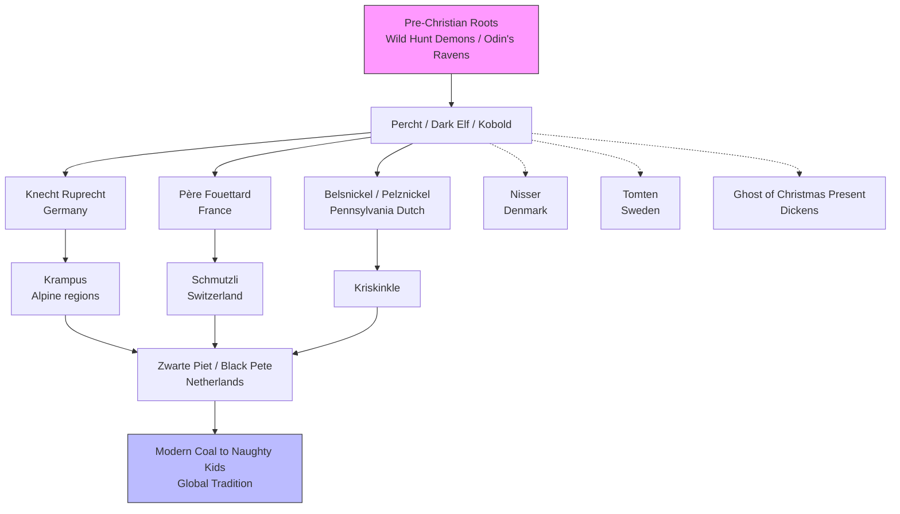

```mermaid
flowchart TD
    A[Pre-Christian Roots<br/>Wild Hunt Demons / Odin's Ravens] --> B[Percht / Dark Elf / Kobold]
    
    B --> C[Knecht Ruprecht<br/>Germany]
    B --> D[Père Fouettard<br/>France]
    B --> E[Belsnickel / Pelznickel<br/>Pennsylvania Dutch]
    
    C --> F[Krampus<br/>Alpine regions]
    D --> G[Schmutzli<br/>Switzerland]
    E --> H[Kriskinkle]
    
    F --> I[Zwarte Piet / Black Pete<br/>Netherlands]
    G --> I
    H --> I
    
    I --> J[Modern Coal to Naughty Kids<br/>Global Tradition]
    
    B -.-> K[Nisser<br/>Denmark]
    B -.-> L[Tomten<br/>Sweden]
    B -.-> M[Ghost of Christmas Present<br/>Dickens]
    
    style A fill:#f9f,stroke:#333
    style J fill:#bbf,stroke:#333
```
