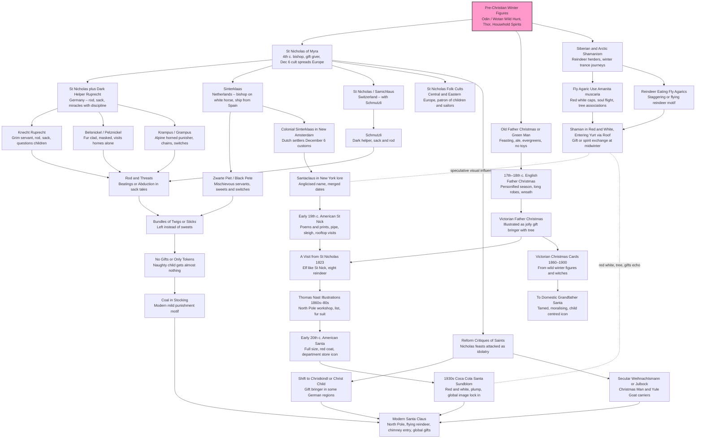

```mermaid
flowchart TD

    %% ROOTS
    A[Pre-Christian Winter Figures<br/>Odin / Wotan Wild Hunt, Thor, Household Spirits]:::root

    %% EARLY CHRISTIAN SAINT
    A --> B[St Nicholas of Myra<br/>4th c. bishop, gift giver, Dec 6 cult spreads Europe]

    %% MEDIEVAL / EARLY MODERN EUROPE
    B --> C1[St Nicholas plus Dark Helper Ruprecht<br/>Germany – rod, sack, miracles with discipline]
    B --> C2[Sinterklaas<br/>Netherlands – bishop on white horse, ship from Spain]
    B --> C3[St Nicholas / Samichlaus<br/>Switzerland – with Schmutzli]
    B --> C4[St Nicholas Folk Cults<br/>Central and Eastern Europe, patron of children and sailors]

    %% COMPANIONS / PUNISHERS
    C1 --> D1[Knecht Ruprecht<br/>Grim servant, rod, sack, questions children]
    C1 --> D2[Belsnickel / Pelznickel<br/>Fur clad, masked, visits homes alone]
    C1 --> D3[Krampus / Grampus<br/>Alpine horned punisher, chains, switches]
    C3 --> D4[Schmutzli<br/>Dark helper, sack and rod]
    C2 --> D5[Zwarte Piet / Black Pete<br/>Mischievous servants, sweets and switches]

    %% SOFTENING OF PUNISHMENT
    D1 --> E1[Rod and Threats<br/>Beatings or Abduction in sack tales]
    D2 --> E1
    D3 --> E1
    D4 --> E1
    D5 --> E2[Bundles of Twigs or Sticks<br/>Left instead of sweets]
    E1 --> E2
    E2 --> E3[No Gifts or Only Tokens<br/>Naughty child gets almost nothing]
    E3 --> E4[Coal in Stocking<br/>Modern mild punishment motif]

    %% PROTESTANT / NORTHERN REFORMATIONS
    B --> F1[Reform Critiques of Saints<br/>Nicholas feasts attacked as idolatry]
    F1 --> F2[Shift to Christkindl or Christ Child<br/>Gift bringer in some German regions]
    F1 --> F3[Secular Weihnachtsmann or Julbock<br/>Christmas Man and Yule Goat carriers]

    %% BRITISH FATHER CHRISTMAS LINE
    A --> G1[Old Father Christmas or Green Man<br/>Feasting, ale, evergreens, no toys]
    G1 --> G2[17th–18th c. English Father Christmas<br/>Personified season, long robes, wreath]
    G2 --> G3[Victorian Father Christmas<br/>Illustrated as jolly gift bringer with tree]

    %% DUTCH–AMERICAN SANTA LINE
    C2 --> H1[Colonial Sinterklaas in New Amsterdam<br/>Dutch settlers December 6 customs]
    H1 --> H2[Santaclaus in New York lore<br/>Anglicised name, merged dates]
    H2 --> H3[Early 19th c. American St Nick<br/>Poems and prints, pipe, sleigh, rooftop visits]

    %% CLEMENT CLARKE MOORE / NAST ERA
    H3 --> I1["A Visit from St Nicholas" 1823<br/>Elf like St Nick, eight reindeer]
    G3 --> I1
    I1 --> I2[Thomas Nast Illustrations 1860s–80s<br/>North Pole workshop, list, fur suit]

    %% COMMERCIAL STANDARDIZATION
    I2 --> J1[Early 20th c. American Santa<br/>Full size, red coat, department store icon]
    J1 --> J2[1930s Coca Cola Santa Sundblom<br/>Red and white, plump, global image lock in]

    %% GLOBAL MODERN SANTA
    J2 --> K1[Modern Santa Claus<br/>North Pole, flying reindeer, chimney entry, global gifts]
    E4 --> K1
    F2 --> K1
    F3 --> K1

    %% SHAMANIC / FUNGI / REINDEER THREAD
    A --> L1[Siberian and Arctic Shamanism<br/>Reindeer herders, winter trance journeys]
    L1 --> L2[Fly Agaric Use Amanita muscaria<br/>Red white caps, soul flight, tree associations]
    L1 --> L3[Reindeer Eating Fly Agarics<br/>Staggering or flying reindeer motif]
    L2 --> L4[Shaman in Red and White, Entering Yurt via Roof<br/>Gift or spirit exchange at midwinter]
    L3 --> L4
    L4 -. speculative visual influence .- H2
    L4 -. red white, tree, gifts echo .- J2

    %% VICTORIAN & MODERN SYMBOLIC LAYERS
    G3 --> M1[Victorian Christmas Cards 1860–1900<br/>From wild winter figures and witches]
    M1 --> M2[To Domestic Grandfather Santa<br/>Tamed, moralising, child centred icon]

    classDef root fill:#f9c,stroke:#333,stroke-width:2px;

```

